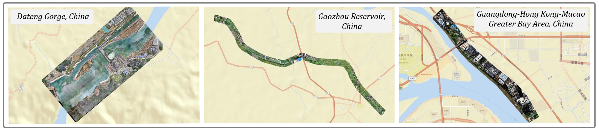

# 大型水利领域户外点云数据集

[English](./README.md)

## 简介

本数据包含了中水大规模户外水利场景的激光3D点云扫描数据，采集了大湾区堤防-佛山，高州水库，大藤峡等流域对应场景下的3D点云数据，这样的数据集将被用于训练和测试项目的环境检测算法，以实现对水利工程周边环境的准确监测和分析。

其中数据集制作方面，根据国标 GBT 20257.1-2017 基本比例尺地图图式，结合水利领域工程实践实际，确定3D点云分割的地形要素类，共刘个大类，15个小类，具体来说如下：

| Major Category |                 | Minor Category |         |
| -------------- | --------------- | -------------- | ------- |
| Water system   | Waterline       | Ditch          | Dam     |
| Bui. and fac.  | Shed            | Concrete House |         |
| Topography     | Slope           | Scarp          |         |
| Veg. and soil  | Vegetable Field | Grassland      | Dryland |
|                | Bareland        | Woodland       |         |
| Transportation | Cement Road     | Dirt Road      |         |
| Others         | Others          |                |         |

本数据集区域集中在水库和河网地带，这些区域的地形要素复杂。 由于自然界的事物分界不明显，因此本数据集对于自然事物分割任务也有很大意义，可以作为一个基础数据集来评价3D点云分割算法的性能。

## 特点

本数据集的特点主要有以下几点：
（1）类别多。如表2.1，本数据集包含15个小类，基本覆盖了水利设施的主要组成元素，如建筑、道路、地形、水体等。这些类别丰富和全面，可以满足对水利设施多角度分析的需求。

（2）覆盖面积大、数据量大。如表2.2，采集的3D点云数据覆盖了集了大湾区堤防-佛山，高州水库，大藤峡等流域的多个典型水利设施场景，地域范围广，具有较好的代表性。大样本量数据有利于开发更加鲁棒的算法模型。3D点云数据根据地理位置的不同划分为3个Work，其中Work_1为大藤峡水利枢纽工程重点施工区，共104,654,477个点，Work_2为东干渠-珠基高，共131,112,786个点，Work_3为佛山大湾区堤防，共28,895,223个点。

（3）真实场景数据，高质量标注。本数据来自实际水利设施的航拍，具有真实场景的特征，可直接用于相关算法和产品的测试验证。同时，数据集进行了人工检查标注，确保了标注的准确性和一致性。这为基于该数据集进行的后续算法研究奠定了坚实的基础。

​	当前公开的3D点云数据集以室内场景或城市街景为主，水利设施场景的数据较少。本数据集帮助填补了这一空缺，为水利设施的自动化分析和管理提供了基础数据支持。本数据集数据量大、覆盖广、标注精细、真实可靠，可为水利设施的数字化管理提供强有力的数据支持，是当前公开水利场景3D点云数据中较为丰富和有价值的一个数据集。

## 下载

- 百度网盘链接: https://pan.baidu.com/s/1eI5K7dvPymsr_RWY6meIrA?pwd=iisk 提取码: iisk

- Kaggle: https://www.kaggle.com/datasets/happycv/segment-hydraulic

## 使用协议

本数据集基于知识共享署名-非商业性使用-相同方式共享 4.0 国际 (CC BY-NC-SA 4.0) 协议授权使用。

您可以自由地:

- **共享** — 在任何媒介以任何形式复制、发行本数据集
- **演绎** — 修改、转换或以本数据集为基础进行创作

- 只要你遵守下列条款:

- **署名** — 您必须给出适当的署名,提供指向本协议的链接,同时标明是否(对原始数据)作了修改。您可以用任何合理的方式来署名,但是不得以任何方式暗示许可方认可您或您的使用。

- **非商业性使用** — 您不得将本数据集用于任何商业目的。

- **相同方式共享** — 如果您再混合、转换或者基于本数据集进行创作,您必须基于与原先许可协议相同的许可协议分发您贡献的作品。

- **没有附加限制** — 您不能增设法律条款或科技措施,来限制别人依据许可协议许可的权利。

## 引用

如果您在研究中使用了本数据集，请点击本项目右侧的`Cite this repository`进行引用。

请注意遵守 CC BY-NC-SA 4.0 协议的各项条款。

## 联系

如果对数据集有任何问题,欢迎联系 [zhou_wei@xtu.edu.cn](mailto:zhou_wei@xtu.edu.cn)
